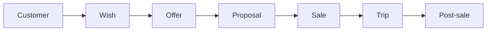
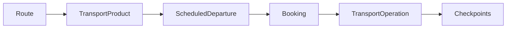
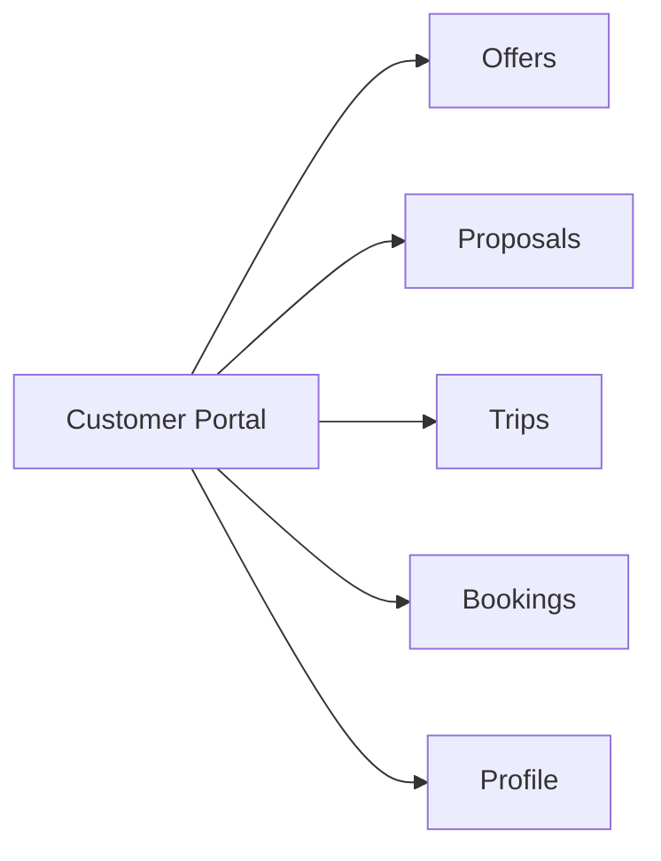
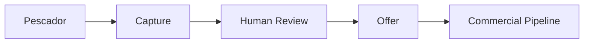
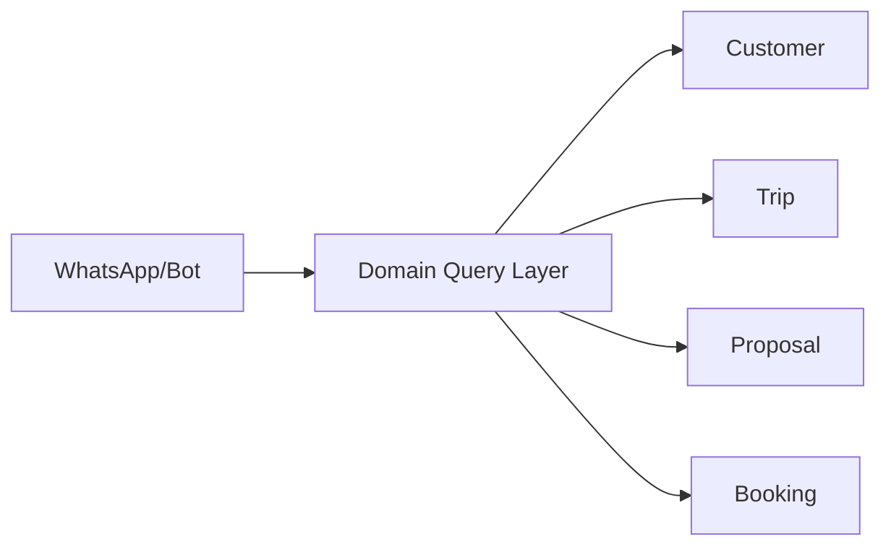

# Travel Platform — Visão do Produto e Escopo

> **Nota para agentes de IA:** Este documento descreve a visão e o escopo do
> produto. Não substitui ADRs, schema, migrations ou documentação específica de
> domínio. Em conflito sobre comportamento implementado, consultar as fontes
> técnicas específicas: `schema.prisma`, `infrastructure/migrations/*.sql`,
> `docs/02-domain/*.md`, `docs/adr/*.md` e código-fonte em
> `services/api/src/`.

---

## Sumário Executivo

Travel Platform é uma plataforma SaaS de gestão para agências e operadores de
turismo que centraliza o ciclo completo do relacionamento com o cliente e da
operação de viagens — da captação da intenção até o pós-venda, incluindo
reservas, transportes e operações de campo.

O produto atende três públicos distintos por meio de interfaces separadas que
compartilham o mesmo domínio e backend:

1. **Agency Admin** — gestão interna da agência (equipe, clientes, comercial,
   operações, financeiro).
2. **Customer Portal** — canal direto do cliente com a agência (viagens,
   propostas, reservas, perfil).
3. **Field Operations** — experiência operacional para motoristas, guias e
   operadores em campo (check-in, cronograma, pontos monitorados).

---

## 1. Problema que o Produto Resolve

Agências de viagem operam com fluxos fragmentados:

- Clientes cadastrados em planilhas ou sistemas genéricos.
- Desejos e intenções de viagem perdidos em conversas de WhatsApp.
- Ofertas e propostas geradas manualmente sem rastreabilidade.
- Vendas registradas depois, quando já não há mais controle.
- Reservas operacionais (voos, ônibus, transferes) fora do sistema.
- Operações de campo (motoristas, guias) sem acompanhamento.
- Dados comerciais e operacionais em silos separados.
- Sem visão consolidada do histórico de relacionamento com o cliente.

Travel Platform resolve isso oferecendo um sistema único que conecta:

```
PROSPECÇÃO → INTENÇÃO → OFERTA → PROPOSTA → VENDA → RESERVA → VIAGEM
→ OPERAÇÃO → PÓS-VENDA
```

---

## 2. Arquitetura do Produto

### 2.1 Experiências

| Experiência | Público | Status |
|-------------|---------|--------|
| Agency Admin | Equipe interna da agência | IMPLEMENTED |
| Customer Portal | Clientes finais | IMPLEMENTED |
| Field Operations | Motoristas, guias, operadores | IMPLEMENTED |

### 2.2 Stack Tecnológica

| Camada | Tecnologia |
|--------|-----------|
| Runtime | Node.js >= 24 |
| Linguagem | TypeScript |
| Monorepo | npm workspaces + Turborepo |
| Backend | Fastify |
| Database | PostgreSQL |
| ORM | Prisma (gerado por introspecção; SQL é fonte de verdade — ADR-005) |
| Testes | Vitest |
| Frontend | React + TypeScript + Vite |
| CSS | Tailwind CSS v4 |
| Infra | Docker / docker-compose |
| IaC | Terraform (DEFERRED) |

### 2.3 Estrutura do Monorepo

```
travel-platform/
├── apps/
│   ├── agency/          # Portal da agência (placeholder)
│   ├── broker/          # Portal do broker (placeholder)
│   └── customer/        # Portal do cliente + Admin panel
├── services/
│   └── api/             # Fastify API service
├── packages/
│   ├── database/        # Prisma schema (derivado)
│   └── domain/          # Tipos de domínio, tenant context
├── infrastructure/
│   ├── migrations/      # SQL migrations (fonte de verdade)
│   └── docker/
├── tests/
│   ├── security/        # Testes de isolamento
│   └── integration/     # Testes de banco/RLS
└── docs/
```

### 2.4 Duas Experiências em um App

O diretório `apps/customer` contém duas superfícies de UI separadas:

- **Staff Admin Panel** (rotas sob `/`) — para a equipe interna da agência.
- **Customer Portal** (rotas sob `/customer-portal`) — para clientes finais.

Ambas compartilham o mesmo bundle React, mas possuem shells de layout,
navegação e clientes de API completamente separados. Isso é uma barreira
de segurança deliberada: o portal do cliente não tem acesso às rotas da
administração e vice-versa.

---

## 3. Customer — Núcleo de Relacionamento

Customer é a entidade central do produto. Toda a relação comercial e
operacional gira em torno do cliente.

### 3.1 Modelo

- Customer pertence a uma Agency (tenant-scoped por `agencyId`).
- Identificador técnico: `id` (UUID). Email e CPF são atributos de
  negócio, não identidade principal.
- CPF e email são únicos por agência quando informados.
- Soft delete via `deletedAt`.
- A mesma pessoa pode existir em múltiplas agências como registros
  separados (histórico multiagência é DEFERRED).

### 3.2 CustomerAccount

- Identidade de login separada do Customer.
- Vinculada ao Customer e à Agency.
- Permite que o cliente final autentique no Customer Portal.
- Schema implementado; API e frontend parcialmente implementados.

### 3.3 Customer 360

Visão consolidada do histórico completo de um cliente:

| Dado | Entidade |
|------|----------|
| Dados pessoais | Customer |
| Intenções de viagem | Wish |
| Propostas recebidas | Proposal |
| Vendas realizadas | Sale |
| Viagens concretas | Trip |
| Reservas operacionais | Booking |
| Transportes | ScheduledDeparture via Booking |
| Interações | CustomerInteraction (FUTURE) |
| Follow-ups | FollowUp (FUTURE) |

**Objetivo:** um funcionário autorizado deve conseguir encontrar rapidamente
todo o histórico e situação comercial/operacional de um cliente.

---

## 4. Wish — Intenção de Viagem

Wish representa uma intenção estruturada de viagem do cliente, com estrutura
suficiente para virar um pedido comercial.

### 4.1 Definição

- Wish NÃO é Offer, Proposal, Sale, Lead nem oportunidade comercial.
- Wish pertence a um Customer dentro de uma Agency.
- Pode ser criado pelo cliente final (Customer Portal) ou pela agência.

### 4.2 Propriedades

| Campo | Obrigatório | Descrição |
|-------|-------------|-----------|
| destination | Não | Destino desejado |
| startDate | Não | Data preferida de início |
| endDate | Não | Data fim preferida |
| budget | Não | Orçamento máximo |
| travelersCount | Não | Número de viajantes |
| notes | Não | Observações |
| status | Sim | ACTIVE, MATCHED, PROPOSED, FULFILLED, EXPIRED, CANCELLED |

### 4.3 Ciclo de Vida

```
ACTIVE → MATCHED → PROPOSED → FULFILLED
                                  ↓
                          EXPIRED / CANCELLED
```

**Status implementado:** ACTIVE, MATCHED, PROPOSED, FULFILLED, EXPIRED,
CANCELLED (schema e CRUD).

### 4.4 Relação com Offer

Wish pode orientar matching manual ou futuro matching automatizado com Offers.
Wish não deve depender diretamente de Offer no V1.

---

## 5. Offer — Oferta Comercial

Offer é uma oferta reutilizável e interna da Agency.

### 5.1 Definição

- Offer representa aquilo que a agência oferece antes de virar uma Proposal.
- Offer NÃO se limita a transporte — pode representar turismo, pacotes,
  serviços, transporte e outros produtos comerciais.
- Offer pertence apenas à Agency, sem vínculo obrigatório com Trip, Customer
  ou Wish.

### 5.2 Propriedades

| Campo | Obrigatório | Descrição |
|-------|-------------|-----------|
| name | Sim | Nome da oferta |
| description | Não | Descrição |
| price | Sim | Preço (>= 0) |
| validFrom | Não | Data/hora de início de validade |
| validUntil | Não | Data/hora de término de validade |
| status | Sim | ACTIVE, INACTIVE, EXPIRED |

### 5.3 Expiração Derivada

O campo `status` persistido nunca é alterado automaticamente. Toda leitura
exibe `status = EXPIRED` quando `validUntil < now()`, computado em tempo
de leitura, sem cron, trigger ou job.

---

## 6. Pescador de Ofertas

### 6.1 Visão Planejada

O Pescador é um módulo futuro que permitirá à agência capturar e importar
oportunidades/ofertas encontradas em fontes externas.

### 6.2 Fluxo Conceitual

```
CAPTURA EXTERNA → NORMALIZAÇÃO → REVISÃO HUMANA → APROVAÇÃO → OFERTA INTERNA
```

**Princípio:** O Pescador NÃO deve publicar automaticamente conteúdo externo
como Offer oficial sem revisão humana.

### 6.3 Preferência Arquitetural

Manter captura e proveniência como fluxo/entidade própria, evitando poluir
Offer com detalhes específicos de scraping/importação.

### 6.4 Possibilidades Futuras

| Campo | Descrição |
|-------|-----------|
| sourceUrl | URL de origem |
| source | Fonte (site, GDS, parceiro) |
| capturedAt | Data de captura |
| rawContent | Conteúdo bruto |
| normalizedContent | Conteúdo normalizado |
| foundPrice | Preço encontrado |
| validity | Validade da oferta externa |
| reviewStatus | Status de revisão humana |
| reviewer | Responsável pela revisão |

### 6.5 Status

**DEFERRED** — Não implementado. ADR-004 registra explicitamente que o
Pescador não faz parte do V1 e que proveniência externa não deve ser
acoplada a Offer.

---

## 7. Proposal — Proposta Comercial

Proposal é uma proposta comercial direcionada a um Customer específico.

### 7.1 Definição

- Proposal nasce de uma Offer (opcional) e/ou de um Wish (opcional).
- Proposal é o passo entre "o que a agência oferece" e "uma futura venda".

### 7.2 Propriedades

| Campo | Obrigatório | Descrição |
|-------|-------------|-----------|
| customerId | Sim | Customer destinatário |
| offerId | Não | Offer de origem |
| wishId | Não | Wish de origem |
| proposedPrice | Sim | Preço proposto |
| discount | Não | Desconto absoluto (padrão 0) |
| total | Sim | **Calculado:** `proposedPrice - discount` |
| validUntil | Não | Data/hora de validade |
| conditions | Não | Condições comerciais |
| status | Sim | DRAFT, SENT, ACCEPTED, DECLINED, EXPIRED, CANCELLED |

### 7.3 Regras Implementadas

- `total = proposedPrice - discount` — sempre calculado no servidor.
- `proposedPrice >= 0`, `discount >= 0`, `discount <= proposedPrice`.
- `customerId`, `offerId`, `wishId` são imutáveis após criação.
- `status` é somente leitura nesta vertical (sem transições de status).

### 7.4 Lifecycle Implementado vs Futuro

| Aspecto | Estado |
|---------|--------|
| CRUD completo | IMPLEMENTED |
| Transições de status | DEFERRED (aguarda Sale) |
| Ligação automática com Sale | DEFERRED |

---

## 8. Sale — Venda

Sale é o fechamento comercial/financeiro.

### 8.1 Definição

- Sale registra a venda, guarda valores, descontos e status
  comercial/financeiro.
- Sale vincula Customer, usuário vendedor, Broker (opcional) e Commission.
- Sale é a base primária para Commission.

### 8.2 Schema Implementado

| Campo | Tipo | Descrição |
|-------|------|-----------|
| agency_id | TEXT FK | Tenant |
| customer_id | TEXT FK | Cliente |
| proposal_id | TEXT FK (nullable) | Proposta de origem |
| broker_id | TEXT FK (nullable) | Broker intermediário |
| user_id | TEXT FK | Vendedor responsável |
| amount | NUMERIC(10,2) | Valor |
| discount | NUMERIC(10,2) | Desconto |
| total | NUMERIC(10,2) | Total |
| status | Enum | PENDING, CONFIRMED, PAID, CANCELLED, REFUNDED |

### 8.3 Gaps

| Aspecto | Estado |
|---------|--------|
| Schema SQL | IMPLEMENTED |
| RLS policies | IMPLEMENTED |
| API handler (services/api/src/sales.ts) | IMPLEMENTED / PR READY (feature/sale-vertical) |
| Frontend CRUD | IMPLEMENTED / PR READY (feature/sale-vertical) |
| Lifecycle de status | NÃO IMPLEMENTADO |
| Integração com pagamento | DEFERRED |
| Ligação com Booking | DEFERRED |

---

## 9. Commission — Comissão

Commission é o cálculo da comissão de um broker sobre uma venda.

### 9.1 Schema Implementado

| Campo | Tipo | Descrição |
|-------|------|-----------|
| agency_id | TEXT FK | Tenant |
| sale_id | TEXT FK | Venda vinculada |
| broker_id | TEXT FK (nullable) | Broker |
| user_id | TEXT FK (nullable) | Usuário |
| amount | NUMERIC(12,2) | Valor da comissão |
| percentage | NUMERIC(5,2) | Percentual aplicado |
| status | Enum | PENDING, PAID, CANCELLED |

### 9.2 Gaps

| Aspecto | Estado |
|---------|--------|
| Schema SQL | IMPLEMENTED |
| RLS policies | IMPLEMENTED |
| UNIQUE(agency_id, id) | IMPLEMENTED (PR #12 — repair estrutural) |
| Cálculo automático | NÃO IMPLEMENTADO |
| API handler | NÃO EXISTE |
| Rateio por Booking | DEFERRED |

---

## 10. Trip — Viagem Concreta

Trip representa a viagem concreta do cliente e serve como base para
histórico.

### 10.1 Definição (ADR-004)

- Trip NÃO representa produto genérico, pacote de catálogo nem Offer.
- Trip é a viagem concreta do cliente.
- Trip pode agrupar múltiplos Bookings.

### 10.2 Propriedades

| Campo | Obrigatório | Descrição |
|-------|-------------|-----------|
| customerId | Sim | Cliente/viajante |
| saleId | Não | Venda de origem |
| name | Sim | Nome da viagem |
| destination | Sim | Destino |
| startDate | Sim | Data de início |
| endDate | Sim | Data de término |
| status | Sim | PLANNED, CONFIRMED, IN_PROGRESS, COMPLETED, CANCELLED |
| metadata | Não | JSONB para dados extras |

### 10.3 Implementação

CRUD completo no backend e frontend (admin e customer portal).

---

## 11. Transportação

O sistema atende operação terrestre própria, terceirizada ou revendida.

### 11.1 Entidades

| Entidade | Descrição | Status |
|----------|-----------|--------|
| Route | Percurso reutilizável (origem → destino) | IMPLEMENTED |
| RoutePoint | Pontos ordenados do trajeto | IMPLEMENTED |
| TransportProduct | Produto comercial (rota + preço + tipo) | IMPLEMENTED |
| Supplier | Fornecedor de serviços de transporte | IMPLEMENTED |
| ScheduledDeparture | Saída agendada com capacidade e fornecedor | IMPLEMENTED |
| TransportOperation | Operação em execução (planejado vs real) | IMPLEMENTED |
| OperationCheckpoint | Checkpoint de confirmação na operação | IMPLEMENTED |

### 11.2 Route

Percurso reutilizável entre origem e destino.

| Campo | Descrição |
|-------|-----------|
| origin | Cidade/ponto de origem |
| destination | Cidade/ponto de destino |
| estimatedDuration | Duração estimada em minutos |
| distance | Distância em km |
| notes | Informações intermediárias (paradas livres) |
| active | Ativo/inativo administrativo |

### 11.3 RoutePoint

Pontos ordenados do trajeto. Cada ponto pode ser apenas informativo ou
monitorado (exigindo check-in).

| Campo | Descrição |
|-------|-----------|
| routeId | Rota pai |
| sequence | Posição no trajeto (1-based, positivo) |
| name | Nome do ponto |
| checkpointRequired | Se true, exige monitoramento operacional |
| checkpointType | ARRIVAL, DEPARTURE, ou BOTH |
| plannedOffsetMinutes | Minutos após a saída prevista |

**Princípio:** check-in é opcional por ponto. O sistema NÃO torna check-in
obrigatório para toda rota.

### 11.4 TransportProduct

Produto comercial de transporte.

| Campo | Descrição |
|-------|-----------|
| name | Nome do produto |
| tripType | ONE_WAY ou ROUND_TRIP |
| outboundRouteId | Rota de ida |
| returnRouteId | Rota de volta (obrigatório se ROUND_TRIP) |
| price | Preço (NUMERIC(10,2)) |
| active | Ativo/inativo administrativo |
| publiclyBookable | Disponível para compra pública |

**Regras:**
- ONE_WAY: `returnRouteId` deve ser NULL.
- ROUND_TRIP: `returnRouteId` deve ser NOT NULL.
- `outboundRouteId`, `returnRouteId`, `tripType` são imutáveis após criação.
- `publiclyBookable` é independente de `active`.

### 11.5 Supplier

Fornecedor de serviços de transporte.

| Campo | Descrição |
|-------|-----------|
| name | Nome do fornecedor |
| document | CPF/CNPJ (opcional) |
| contact | Informações de contato |
| active | Ativo/inativo |

### 11.6 ScheduledDeparture

Saída agendada — a instância concreta de uma viagem programada.

| Campo | Descrição |
|-------|-----------|
| productId | Produto de transporte |
| departureAt | Data/hora de saída |
| arrivalExpectedAt | Previsão de chegada |
| capacity | Capacidade máxima (hard limit) |
| supplierId | Fornecedor (nullable — OWN = agência opera) |
| serviceType | OWN, SUBCONTRACTED, ou RESELL |
| cancelled | Se true, capacidade = 0 |

**Capacidade:** `CHECK (capacity >= 0)`. Nenhum overbooking é permitido
(P0). A capacidade é um limite rígido. `availableSeats` é derivado de
Booking: `cancelled ? 0 : capacity - COUNT(bookings ativos)`.

### 11.7 TransportOperation (IMPLEMENTED)

Representa a operação em execução, conectando:

```
ScheduledDeparture → TransportOperation → RoutePoints monitorados
→ OperationCheckpoints → confirmação real
```

A operação é criada a partir de uma ScheduledDeparture e gera
OperationCheckpoints automaticamente para cada RoutePoint monitorado da rota.

**Checkpoints:** cada checkpoint possui `checkpointType` (snapshot do
RoutePoint no momento da criação), `scheduledTime` (derivação de
`departureAt + plannedOffsetMinutes`), `actualTime` (preenchido na
confirmação) e proteção contra confirmação duplicada.

**Interface:** `/operations/today` mostra operações do dia com checklist
mobile-friendly. `/operations/:id` permite confirmar chegada e saída por
ponto.

### 11.8 Agenda

Visualização agregada de saídas programadas, unindo dados de departure,
product, route e supplier com filtro por período.

---

## 12. Booking — Reserva

Booking é a camada operacional de reserva, separada da camada comercial
(Sale) conforme ADR-004.

### 12.1 Definição

- Booking representa reserva operacional: passageiros, saídas, capacidade,
  status de reserva e cancelamento.
- Uma Sale pode possuir vários Bookings (futuro — ligação ainda não
  estabelecida).
- Booking pode representar serviços diferentes dentro da mesma venda.

### 12.2 Modelo Implementado

**Booking:**

| Campo | Descrição |
|-------|-----------|
| customerId | Cliente que fez a reserva |
| outboundDepartureId | Saída de ida (→ ScheduledDeparture) |
| returnDepartureId | Saída de volta (nullable para ONE_WAY) |
| status | PENDING, CONFIRMED, CANCELLED |
| notes | Observações |

**BookingPassenger:**

| Campo | Descrição |
|-------|-----------|
| bookingId | Reserva pai |
| name | Nome do passageiro |
| document | Documento (CPF/passaporte) |

**Regras:**
- ROUND_TRIP exige `returnDepartureId` NOT NULL.
- ONE_WAY exige `returnDepartureId` NULL.
- `outboundDepartureId` e `returnDepartureId` são imutáveis após criação.
- `outboundDepartureId` e `returnDepartureId` devem pertencer ao mesmo
  TransportProduct.
- 1 Booking → N BookingPassenger (multi-passageiro).

### 12.3 Capacidade e Concorrência

**P0: OVERBOOKING = NEVER**

A criação de Booking utiliza `SELECT ... FOR UPDATE` na
ScheduledDeparture para serializar concorrência:

```sql
BEGIN;
SELECT capacity FROM scheduled_departures
  WHERE id = $1 AND agency_id = current_agency_id()
  FOR UPDATE;
-- Verificar: COUNT(booking_passengers ativos) < capacity
-- Inserir booking + passageiros se houver capacidade
COMMIT;
```

### 12.4 Round-Trip

Uma reserva de ida/volta referencia duas instâncias de ScheduledDeparture
(outbound + return), ambas pertencentes ao mesmo TransportProduct. A
reserva atômica verifica capacidade em ambas as saídas dentro da mesma
transação.

### 12.5 Multi-Passageiro

1 Booking → N BookingPassenger. A contagem de passageiros (não de bookings)
é usada para verificar capacidade.

### 12.6 Cancelamento

Cancelamento de Booking é **DEFERRED** — o status CANCELLED existe no schema
mas o fluxo de cancelamento com efeitos colaterais (liberação de capacidade,
notificações, eventual estorno) não está implementado.

---

## 13. Comercial Cockpit / CRM

### 13.1 Objetivo

Dar ao gerente/agente uma visão imediata do andamento comercial.

### 13.2 Perguntas que o Sistema Pretende Responder

| Pergunta | Status |
|----------|--------|
| Quem precisa de retorno hoje? | IMPLEMENTED / BRANCH (feature/commercial-cockpit) |
| Quais retornos estão atrasados? | IMPLEMENTED / BRANCH |
| Quais propostas estão sem resposta? | IMPLEMENTED / BRANCH |
| Quais oportunidades estão paradas? | IMPLEMENTED / BRANCH |
| Quem viaja nos próximos dias? | IMPLEMENTED / BRANCH |
| Quais vendas foram fechadas? | IMPLEMENTED / BRANCH |
| Quem precisa de pós-venda? | IMPLEMENTED / BRANCH |
| Qual é o histórico completo deste cliente? | IMPLEMENTED / BRANCH |

### 13.3 Componentes

| Componente | Descrição | Status |
|------------|-----------|--------|
| Dashboard | Métricas principais | IMPLEMENTED / BRANCH |
| Pipeline/Kanban | Visão de funil com pipeline configurável | IMPLEMENTED / BRANCH |
| Agenda Comercial | Follow-ups e retornos | IMPLEMENTED / BRANCH |
| Customer 360 | Visão consolidada do cliente | IMPLEMENTED / BRANCH |
| Busca | Busca global | IMPLEMENTED / BRANCH |
| Follow-ups (Tasks) | Acompanhamento de pendências | IMPLEMENTED / BRANCH |
| Interações | Histórico de contato | IMPLEMENTED / BRANCH |
| Oportunidades | CommercialOpportunity | IMPLEMENTED / BRANCH |

**Nota:** Todo o código está na branch `feature/commercial-cockpit` (8
commits à frente de main). Inclui schema (CommercialOpportunity, Task,
Interaction), RLS, API, frontend (dashboard, pipeline, agenda, 360),
pipeline configurável, testes de segurança com PostgreSQL real e dados de
demonstração. **Ainda não mergeado em main.**

---

## 14. Pipeline Configurável

### 14.1 Visão Aprovada

A agência poderá ter múltiplos pipelines configuráveis.

### 14.2 Exemplos (não obrigatórios)

**Pipeline Comercial:**
Prospecção → Interesse → Orçamento → Proposta → Aguardando retorno →
Negociação → Vendido

**Pipeline Pós-Venda:**
Aguardando contato → Contato realizado → Feedback → Problema → Resolvido

**Pipelines por especialidade:**
Terrestre, Internacional, Aéreo, Corporativo — cada um com estágios
próprios.

### 14.3 Configuração

Admin poderá definir:
- nome do pipeline
- colunas/estágios
- ordem
- cores
- visibilidade por equipe
- ativação

### 14.4 Cores / Atenção

O admin define o significado visual. O sistema NÃO assume universalmente
que vermelho = ruim ou verde = bom. Regras automáticas futuras podem
destacar follow-up vencido, proposta vencendo, sem interação há N dias,
viagem próxima, etc.

### 14.5 Status

**IMPLEMENTED / BRANCH** — Código completo na branch
`feature/commercial-cockpit`. Backend e frontend para múltiplos pipelines
configuráveis com estágios customizáveis, cores, visibilidade e dados de
demonstração. **Ainda não mergeado em main.**

---

## 15. Equipes / Visibilidade

Equipes podem trabalhar com pipelines diferentes:

- Equipe Terrestre → Pipeline Terrestre
- Equipe Internacional → Pipeline Internacional

Uma equipe não precisa visualizar pipeline da outra quando não autorizada.

**Backend deve controlar autorização; não apenas esconder UI.**

**Status:** IMPLEMENTED / BRANCH — Código na branch
`feature/commercial-cockpit` com suporte a múltiplos pipelines e
visibilidade por pipeline. **Ainda não mergeado em main.**

---

## 16. Agenda Comercial

Agregador visual que pode reunir:

- follow-ups
- retornos de orçamento
- propostas
- viagens
- saídas
- operações
- pós-venda

sem necessariamente persistir tudo como um único tipo de evento.

**Status:** IMPLEMENTED / BRANCH — Agenda implementada na branch
`feature/commercial-cockpit` com visualização de tarefas e oportunidades
por período. **Ainda não mergeado em main.**

---

## 17. Customer Interaction — Histórico de Relacionamento

Histórico de contato com o cliente.

| Campo | Descrição |
|-------|-----------|
| channel | WhatsApp, telefone, email, presencial, outros |
| direction | inbound, outbound |
| content | Conteúdo da interação |
| timestamp | Data/hora |

**Status:** IMPLEMENTED / BRANCH — Tabela `interactions`, API e frontend
implementados na branch `feature/commercial-cockpit`. **Ainda não mergeado
em main.**

---

## 18. WhatsApp / Bots — Canais Futuros

### 18.1 Princípio

Bots devem consumir serviços/queries do domínio central. Não criar banco
separado para bot.

### 18.2 Exemplos Futuros

**Cliente:**
- "Qual é minha próxima viagem?"
- "Que horas sai meu transporte?"
- "Minha proposta ainda está válida?"

**Agência:**
- "Quem precisa de retorno hoje?"
- "Quais propostas estão paradas?"
- "Quem viaja para Gramado no próximo mês?"

### 18.3 Arquitetura

```
WhatsApp/Bot → Domain Query Layer → Customer/Trip/Proposal/Booking/etc.
```

### 18.4 Status

**DEFERRED** — Nenhum código, nenhuma integração, nenhuma ADR específica.

---

## 19. Field Operations / Check-In (IMPLEMENTED)

### 19.1 Fluxo Implementado

```
ScheduledDeparture → TransportOperation → RoutePoints monitorados
→ OperationCheckpoints → confirmação real
```

A operação é criada pelo admin em `/operations/today` para saídas do dia
que ainda não possuem operação. Ao criar, o sistema gera
OperationCheckpoints automaticamente para cada RoutePoint da rota que possui
`checkpointRequired = true`.

### 19.2 Dados por Checkpoint

| Campo | Descrição |
|-------|-----------|
| routePoint | Ponto do roteiro (snapshot no momento da criação) |
| checkpointType | ARRIVAL, DEPARTURE, ou BOTH (snapshot do RoutePoint) |
| scheduledTime | Horário previsto (departureAt + plannedOffsetMinutes) |
| actualTime | Horário real da confirmação |
| confirmedAt | Timestamp da confirmação |

**Proteção contra confirmação duplicada:** cada checkpoint só pode ser
confirmado uma vez. Tentativa de re-confirmação retorna erro.

### 19.3 Interface

- `/operations/today` — lista operações do dia com status, links para
  checklist e botão "Iniciar operação" para saídas sem operação.
- `/operations/:id` — checklist mobile-friendly com botões de confirmação
  de chegada e saída por ponto.

### 19.4 Distinção

- **Field Operations App** — para motoristas, guias, operadores (via admin
  panel, responsivo).
- **Customer App** — para clientes finais (portal separado).
- São experiências completamente separadas.

### 19.5 Driver/Guide Identity

Identidade dedicada de motorista/guia (entidade separada de User) é
**PLANNED** — não implementada.

---

## 20. Localização / Cidades

### 20.1 Evolução Planejada

Autocomplete de cidades usando estrutura como:

| Campo | Descrição |
|-------|-----------|
| ibgeCode | Código IBGE |
| city | Nome da cidade |
| uf | Unidade Federativa |
| country | País |

### 20.2 Possíveis Usos

- Route (origem/destino)
- Trip (destino)
- Customer (endereço)
- Supplier (localização)
- Busca e catálogo
- Filtros

### 20.3 Status

**PLANNED** — Nenhuma tabela ou componente de persistência implementado.

---

## 21. Financial — Financeiro

### 21.1 Necessidade

Controlar:

| Conceito | Descrição |
|----------|-----------|
| Contas a receber | Recebimentos de Sales |
| Contas a pagar | Pagamentos a Suppliers |
| Custos operacionais | Custos de operação de transporte |
| Comissões | Cálculo e pagamento de comissões |
| Margens | Preço de venda vs custo |
| Fluxo de caixa | Projeção e acompanhamento |
| Parcelamentos | Pagamento parcelado (futuro) |
| Relatórios | Dashboards financeiros |

### 21.2 Relacionamento com Entidades

| Entidade | Relação Financeira |
|----------|-------------------|
| Sale | Receita |
| Supplier | Custo / Pagamento |
| TransportOperation | Custo operacional |
| Commission | Comissão a pagar |

### 21.3 Status

**DECISION REQUIRED** — Nenhuma tabela financeira implementada. Nenhum ADR
específico sobre modelo financeiro. Estrutura conceitual não definida.

---

## 22. Pós-Venda

Venda não encerra o relacionamento.

```
Sale → Trip → conclusão → follow-up pós-venda → feedback → relacionamento
futuro
```

Pode usar pipeline próprio (Pipeline Pós-Venda).

**Status:** PLANNED — Conceitual, não implementado.

---

## 23. Relatórios / Management

### 23.1 Visão de Consultas Gerenciais

| Relatório | Status |
|-----------|--------|
| Pipeline / funil | IMPLEMENTED / BRANCH (feature/commercial-cockpit) |
| Conversão de propostas | PLANNED |
| Propostas abertas | PLANNED |
| Vendas por período | PLANNED |
| Destinos mais procurados | PLANNED |
| Viagens futuras | PLANNED |
| Follow-ups pendentes | IMPLEMENTED / BRANCH (feature/commercial-cockpit) |
| Operações do dia | IMPLEMENTED |
| Fornecedores | PLANNED |
| Financeiro | PLANNED |

**Não afirmar dashboards que ainda não existem.**

---

## 24. Customer Portal

### 24.1 Objetivo Estratégico

O cliente final deve possuir canal direto com a agência.

### 24.2 Áreas Atuais (IMPLEMENTED)

| Rota | Página |
|------|--------|
| `/customer-portal` | Home (dashboard com cards: próxima viagem, ofertas, reservas) |
| `/customer-portal/trips` | Lista de viagens |
| `/customer-portal/trips/:id` | Detalhes da viagem |
| `/customer-portal/offers` | Lista de ofertas |
| `/customer-portal/offers/:id` | Detalhes da oferta |
| `/customer-portal/proposals` | Lista de propostas |
| `/customer-portal/proposals/:id` | Detalhes da proposta |
| `/customer-portal/bookings` | Lista de reservas |
| `/customer-portal/bookings/:id` | Detalhes da reserva |
| `/customer-portal/profile` | Perfil do cliente |

### 24.3 Possibilidades Futuras

- Compras e pagamentos
- Documentos de viagem
- Notificações
- Atendimento (WhatsApp/bot)
- Acompanhamento de serviços
- Aceite de proposta
- Compra direta

### 24.4 Self-Scoping

O Customer Portal usa autenticação separada (`CustomerAccount`). O acesso é
limitado ao Customer e à Agency correspondentes. O frontend NÃO envia
`agencyId` como fonte de verdade.

---

## 25. Direct Purchase — Compra Direta

### 25.1 Visão Futura (Transportation)

```
Catálogo → Produto → Saída(s) → Dados do passageiro → Booking → Sale →
Payment
```

### 25.2 Gaps

| Componente | Estado |
|------------|--------|
| Catálogo público | NÃO IMPLEMENTADO (todos os endpoints requerem auth) |
| `publiclyBookable` flag | IMPLEMENTED |
| Booking | IMPLEMENTED |
| Checkout | DEFERRED |
| Pagamento | DEFERRED |

**Não afirmar checkout pronto se não estiver.**

---

## 26. Multi-Tenancy

### 26.1 Princípio Arquitetural

- Cada Agency é um tenant isolado.
- Todas as tabelas possuem `agency_id` como primeira coluna de FK.
- PostgreSQL RLS é habilitado e forçado em todas as tabelas.
- Tenant context é derivado do JWT (server-side), nunca do frontend.
- Fail-closed: sem tenant context, nenhuma query retorna dados.

### 26.2 Implementação

| Mecanismo | Status |
|-----------|--------|
| `agency_id` em todas tabelas | IMPLEMENTED |
| Composite FKs `(agency_id, id)` | IMPLEMENTED |
| RLS ENABLE + FORCE | IMPLEMENTED |
| 4 policies por tabela (SELECT/INSERT/UPDATE/DELETE) | IMPLEMENTED |
| `current_agency_id()` function | IMPLEMENTED |
| `set_tenant_context()` in transaction | IMPLEMENTED |
| Runtime role sem BYPASSRLS | IMPLEMENTED |
| Testes de isolamento | IMPLEMENTED |

### 26.3 Customer Portal

Adiciona self-scoping por customer: o cliente autenticado acessa apenas seus
próprios dados dentro da agency.

---

## 27. RBAC — Controle de Acesso

### 27.1 Hierarquia

```
OWNER  (100) — Pode tudo na agência. Não pode ser removido.
ADMIN  (80)  — Gerencia usuários e configurações.
MANAGER(60)  — Gerencia equipe, viagens, ofertas. Vê relatórios.
AGENT  (40)  — Cadastra clientes, registra vendas.
VIEWER (20)  — Apenas visualiza.
```

### 27.2 Implementação

| Recurso | OWNER | ADMIN | MANAGER | AGENT | VIEWER |
|---------|-------|-------|---------|-------|--------|
| Customers | CRUD | CRUD | CRUD | CRU* | R |
| Wishes | CRUD | CRUD | CRUD | CRUD* | R |
| Trips | CRUD | CRUD | CRUD | R | R |
| Offers | CRUD | CRUD | CRUD | R | R |
| Proposals | CRUD | CRUD | CRUD | R | R |
| Transport Routes | CRUD | CRUD | CRUD | R | R |
| Transport Products | CRUD | CRUD | CRUD | R | R |
| Suppliers | CRUD | CRUD | CRUD | R | R |
| Departures | CRUD | CRUD | CRUD | R | R |

\* Apenas seus próprios registros (quando aplicável)

### 27.3 Transportation RBAC

| Endpoint | Leitura | Escrita |
|----------|---------|---------|
| `/transport/*` (todos) | VIEWER | MANAGER |

---

## 28. Segurança

### 28.1 Princípios

| Princípio | Implementação |
|-----------|---------------|
| Tenant isolation | RLS + composite FKs + transaction-scoped context |
| RBAC | 5 roles com requireRole() |
| IDOR protection | Tenant scoping em toda query |
| Mass assignment | Campos proibidos rejeitados explicitamente |
| Safe errors | Erros genéricos ao cliente, detalhados em log |
| Dev-auth dual gating | Headers synthetic em dev, JWT em produção |
| Concurrency safety | Transactions com set_tenant_context |
| Secrets scanning | Script de validação |
| Migration validation | Script de validação de nomenclatura |

### 28.2 Camadas

```
Frontend → API Gateway → Auth Middleware → Tenant Middleware
→ Domain Layer → Database (RLS) → Infrastructure
```

---

## 29. Qualidade

### 29.1 Quality Gates

| Gate | Comando | Status |
|------|---------|--------|
| Lint | `npm run lint` | IMPLEMENTED |
| Typecheck | `npm run typecheck` | IMPLEMENTED |
| Unit tests | `npm run test` | IMPLEMENTED |
| DB/RLS integration | `npm run test:db` | IMPLEMENTED |
| Security tests | `npm run test` (incluído) | IMPLEMENTED |
| Secrets scan | Script dedicado | IMPLEMENTED |
| Build | `npm run build` | IMPLEMENTED |

### 29.2 Testes

| Categoria | Arquivos | Cobertura |
|-----------|----------|-----------|
| Unit/Security | 5 arquivos em tests/security/ | Tenant isolation, secrets |
| DB Integration | 4 arquivos (SQL + TS) | Migrations, RLS, constraints |
| API Unit | 11 arquivos (por entidade) | CRUD, validation, cross-tenant |
| API E2E | 5 arquivos | Full stack por vertical |
| Frontend | 33+ arquivos | Page-level tests |

---

## 30. Estado das Áreas

| Área | Propósito | Status | Notas |
|------|-----------|--------|-------|
| Customer | CRUD de clientes | IMPLEMENTED | Soft delete, CPF/email uniqueness |
| CustomerAccount | Identidade de login do cliente | IMPLEMENTED | Schema + API |
| Wish | Intenção de viagem | IMPLEMENTED | CRUD completo |
| Trip | Viagem concreta | IMPLEMENTED | CRUD completo |
| Offer | Oferta comercial | IMPLEMENTED | CRUD + expiração derivada |
| Proposal | Proposta comercial | IMPLEMENTED | CRUD + total calculado |
| Sale | Venda | PR READY | feature/sale-vertical (backend + frontend, não mergeado) |
| Commission | Comissão | SCHEMA ONLY | UNIQUE repair merged (PR #12); sem API handler |
| Booking | Reserva operacional | IMPLEMENTED | Capacity engine, round-trip, multi-passageiro |
| Transportation | Routes/Products/Departures | IMPLEMENTED | PR #9 merged |
| Route Points | Pontos de rota | IMPLEMENTED | PR #9 merged |
| Transport Operation | Operação em campo | IMPLEMENTED | PR #11 merged (schema + API + frontend) |
| Field Operations | Check-in/check-out | IMPLEMENTED | PR #11 merged (mobile-friendly checklist) |
| Customer Portal | Portal do cliente | IMPLEMENTED | PR #14 merged (10 páginas, CRUD de leitura) |
| Commercial Cockpit | CRM/Dashboard | PR READY | feature/commercial-cockpit (8 commits, não mergeado) |
| Configurable Pipeline | Pipeline configurável | PR READY | feature/commercial-cockpit (não mergeado) |
| Financial | Financeiro | DECISION REQUIRED | Nenhum ADR, nenhum schema |
| Pescador | Captura de ofertas externas | DEFERRED | ADR-004 registra como futuro |
| Direct Purchase | Compra direta | DEFERRED | Booking pronto; checkout/pagamento pendentes |
| WhatsApp/Bots | Canais de comunicação | DEFERRED | ADR-AGENT-000 documenta readiness |
| Location/IBGE | Autocomplete de cidades | PLANNED | Nenhum código |
| Driver/Guide Identity | Identidade de motorista/guia | PLANNED | Nenhum código |
| Booking Cancellation | Cancelamento de reserva | DEFERRED | Status existe; fluxo completo não implementado |
| Proposal Lifecycle | Transições de status | DEFERRED | Aguarda Sale |
| Sale/Payment Lifecycle | Ciclo de pagamento | DEFERRED | Sale branch existe; lifecycle não implementado |
| Post-sale | Pós-venda | PLANNED | Conceitual apenas |
| Reports | Relatórios gerenciais | PLANNED | Nenhum dashboard |

---

## 31. Princípios de Produto

### ONE SOURCE OF TRUTH

Não duplicar dados para dashboards, apps ou bots. O domínio central é a
única fonte de verdade.

### HUMAN APPROVAL FOR SENSITIVE AUTOMATION

Automação não deve silenciosamente tomar decisão comercial importante.
Pescador publica sem revisão humana? Nunca.

### TENANT FIRST

Toda funcionalidade nasce considerando isolamento por agency. Não é uma
otimização posterior.

### MOBILE WHERE OPERATIONAL

Campo e cliente devem funcionar bem em celular. Operações de campo são
inherentemente móveis.

### CONFIGURABLE WHERE BUSINESS VARIES

Pipeline e processos são configuráveis quando diferentes agências ou equipes
trabalham de formas diferentes.

### DO NOT FAKE FEATURES

Área não implementada deve aparecer como planejada, não como dashboard falso.

---

## 32. Jornadas do Produto

### Jornada Comercial



### Jornada de Transporte



### Experiência do Cliente



### Aquisição Futura (Pescador)



### Comunicação Futura (WhatsApp/Bot)



---

## 33. Roadmap Conceitual

### Fase 1 — Foundation (CONCLUÍDA)

- Monorepo, stack, tooling
- Multi-tenancy, RLS, tenant isolation
- Auth, RBAC
- Security model
- Database migrations (001, 002)
- Domain types

### Fase 2 — Core Commercial (CONCLUÍDA)

- Customer CRUD
- Wish CRUD
- Trip CRUD
- Offer CRUD
- Proposal CRUD
- Customer Portal (leitura)
- Sale schema + RLS

### Fase 3 — Transportation (CONCLUÍDA)

- Route, RoutePoint
- TransportProduct
- Supplier
- ScheduledDeparture
- Transport Admin frontend
- Agenda

### Fase 4 — Booking & Field Operations (CONCLUÍDA)

- Booking (capacity engine, round-trip, multi-passageiro)
- TransportOperation / OperationCheckpoint
- Field Operations checklist (mobile-friendly)

### Fase 5 — Commission Repair & Customer Portal (CONCLUÍDA)

- Commission UNIQUE(agency_id, id) structural repair
- Customer Portal completo (10 páginas)

### Fase 6 — Sale & Commercial Cockpit (EM ANDAMENTO)

- Sale (backend + frontend) — branch pronta, não mergeada
- Commercial Cockpit (dashboard, pipeline, agenda, 360) — branch pronta
- Configurable Pipeline — branch pronta

### Fase 7 — Next Business Foundations (PLANEJADA)

- Financial model (ADR necessário)
- Driver/Guide identity
- Proposal lifecycle transitions
- Sale/Payment lifecycle

### Fase 8 — Automation / Growth (DEFERRED)

- Pescador
- WhatsApp/Bots
- Direct Purchase (checkout e pagamento)
- Notifications
- AI matching

### Fase 9 — UX / Productization (PLANEJADA)

- Design system
- Layout refinement
- Reports dashboards

---

## 34. Non-Goals / Não está Pronto

| Capacidade | Estado |
|------------|--------|
| Payment provider integrado | DEFERRED |
| Apps nativos (iOS/Android) | DEFERRED |
| GPS tracking | DEFERRED |
| WhatsApp integration | DEFERRED |
| AI bot | DEFERRED |
| Pescador production crawler | DEFERRED |
| Financial accounting | DEFERRED |
| Document management | DEFERRED |
| Refund automation | DEFERRED |
| Complex notification engine | DEFERRED |
| Multi-agency history | DEFERRED |
| GDS integration | DEFERRED |
| Multi-idioma | DEFERRED |
| Marketplace entre agências | DEFERRED |
| Booking cancellation flow completo | DEFERRED |
| Proposal → Sale lifecycle | DEFERRED |
| Sale → Payment lifecycle | DEFERRED |

---

## 35. Glossário

| Termo | Definição |
|-------|-----------|
| **Agency** | Tenant principal. Cada agência é um tenant isolado. |
| **User** | Usuário interno da agência (equipe). |
| **Customer** | Cliente final da agência. |
| **CustomerAccount** | Identidade de login do cliente no Customer Portal. |
| **Wish** | Intenção estruturada de viagem do cliente. |
| **Offer** | Oferta reutilizável e interna da agência. |
| **Proposal** | Proposta comercial direcionada a um Customer. |
| **Sale** | Negócio comercial/financeiro fechado. |
| **Trip** | Viagem concreta do cliente e base para histórico. |
| **Booking** | Reserva operacional. Separada de Sale. |
| **Commission** | Comissão de um broker sobre uma venda. |
| **Broker** | Intermediário comercial. |
| **Route** | Percurso reutilizável (origem → destino). |
| **RoutePoint** | Ponto ordenado do trajeto de uma Route. |
| **TransportProduct** | Produto comercial de transporte (rota + preço). |
| **Supplier** | Fornecedor de serviços de transporte. |
| **ScheduledDeparture** | Saída agendada com capacidade e fornecedor. |
| **TransportOperation** | Operação em execução (planejado vs real). |
| **OperationCheckpoint** | Confirmação de chegada/saída em um RoutePoint. |
| **Pipeline** | Fluxo configurável de estágios (comercial, pós-venda, etc.). |
| **Follow-up** | Pendência de retorno ou acompanhamento. |
| **Pescador** | Módulo futuro de captação de ofertas externas. |
| **Customer 360** | Visão consolidada do histórico de um cliente. |
| **Agenda** | Visualização agregada de compromissos e operações. |
| **RLS** | Row-Level Security do PostgreSQL. |
| **Tenant** | Unidade de isolamento (Agency). |

---

## 36. Referências

| Documento | Caminho |
|-----------|---------|
| ADR-001 (Monorepo) | `docs/adr/ADR-001-architecture.md` |
| ADR-002 (Multi-tenancy) | `docs/adr/ADR-002-multitenancy.md` |
| ADR-003 (Auth) | `docs/adr/ADR-003-authentication.md` |
| ADR-004 (Domain Model) | `docs/adr/ADR-004-domain-modeling-wish-customer-sale-booking.md` |
| ADR-005 (Schema Source of Truth) | `docs/adr/ADR-005-database-schema-source-of-truth.md` |
| ADR-SEC-001 (deepmerge-ts) | `docs/adr/ADR-SEC-001-deepmerge-ts-risk-acceptance.md` |
| ADR-AGENT-000 (Agent Readiness) | `docs/adr/ADR-AGENT-000-agent-readiness.md` |
| Domain Model | `docs/02-domain/domain-model.md` |
| Security Model | `docs/03-security/security-model.md` |
| Authorization | `docs/03-security/authorization.md` |
| Testing Strategy | `docs/07-testing/strategy.md` |
| Quality Gates | `QUALITY-GATES.md` |
| Schema (derived) | `packages/database/schema.prisma` |
| Migrations (source of truth) | `infrastructure/migrations/` |
