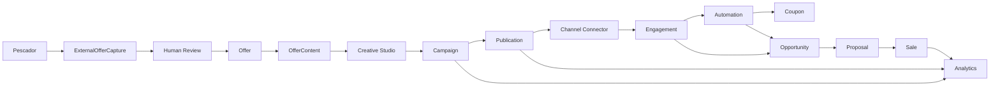
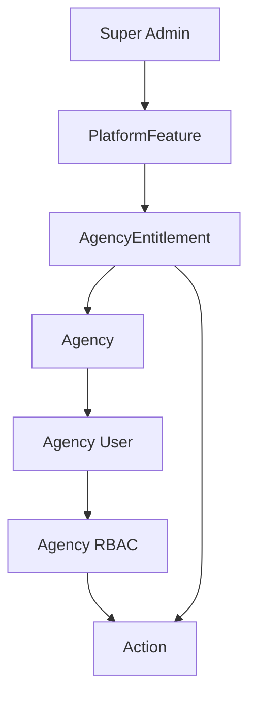

# Offer & Growth Engine

Offer & Growth Engine e a arquitetura oficial proposta para conectar aquisicao
de conteudo, criacao de ofertas, producao criativa, publicacao, interesse,
automacao, cupons, oportunidades, propostas, vendas e analytics.

Este pacote e documentation-first. Ele nao implementa runtime, nao cria
migrations, nao altera `schema.prisma` e nao altera telas existentes.

## Principio central

A maquina de ofertas nao e apenas marketing. Ela e o nucleo do fluxo:

Nenhum canal externo possui a logica comercial. Instagram, Facebook, WhatsApp,
site, email, Customer Portal e canais futuros sao apenas Channel Connectors.

## Documentos

| Documento | Proposito |
|-----------|-----------|
| `domain-model.md` | Entidades, limites e relacionamentos conceituais |
| `creative-studio.md` | Contrato de templates, blocos, slots, bindings e assets |
| `campaigns-publications.md` | Campaign, Publication, snapshots e agenda |
| `automation-engine.md` | Gatilhos, acoes, keyword automation e cupons |
| `channel-connectors.md` | Contrato generico de conectores |
| `entitlements.md` | Super Admin, Agency Entitlement e RBAC |
| `analytics-attribution.md` | Cadeia de atribuicao e metricas |
| `security.md` | Multitenancy, RLS e tenant-safe contracts |
| `implementation-roadmap.md` | Ondas de implementacao e dependencias |

## Fronteiras

- ExternalOfferCapture guarda dados externos brutos.
- Offer e a oferta comercial oficial da agencia.
- Asset guarda midia reutilizavel.
- OfferContent expoe dados estruturados consumiveis por templates.
- Creative Studio renderiza conteudo estruturado; nao decide campanha, cupom ou
  venda.
- Campaign coordena objetivo, periodo, canais, publicacoes, automacoes e cupons.
- Publication representa uma entrega agendada/publicada com snapshot imutavel.
- Engagement registra interacao recebida de canal.
- Automation reage a eventos e executa acoes controladas.
- Coupon e dominio proprio para beneficios e desconto.
- Opportunity, Proposal e Sale continuam pertencendo ao dominio comercial.

## Entitlements e RBAC

O Super Admin controla disponibilidade por agencia. Depois disso, RBAC da
agencia controla quem pode ler, criar, publicar, ativar automacoes, gerenciar
cupons, configurar conectores e ler analytics.

## Status

Este contrato esta pronto para servir de base para implementacao futura. As
decisoes humanas inevitaveis estao listadas em `implementation-roadmap.md`.
