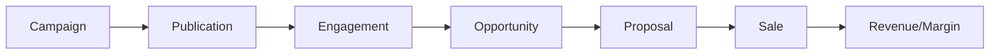
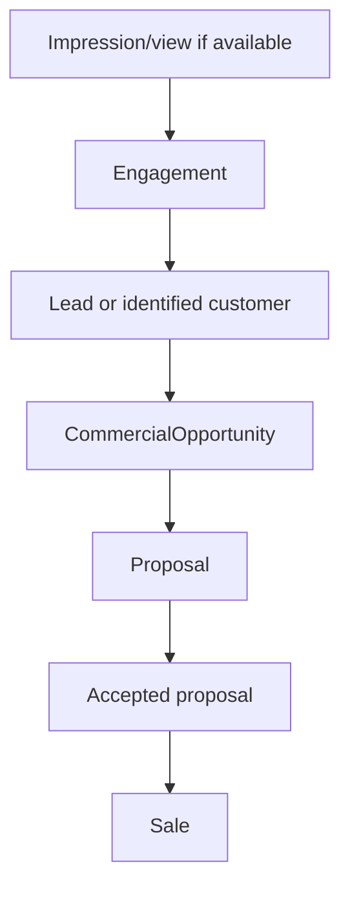

# Analytics and attribution

Analytics do Offer & Growth Engine deve medir aquisicao, publicacao, interesse,
automacao e conversao comercial sem inventar metricas que os conectores nao
entregam.

## Attribution chain

Quando a origem for conhecida, preservar:

- campaign;
- publication;
- creative snapshot;
- offer;
- channel;
- engagement;
- automation;
- coupon;
- customer;
- opportunity;
- proposal;
- sale.

## Dimensoes

Metrica futura pode ser agrupada por:

- Campaign;
- Offer;
- Publication;
- Creative;
- Channel;
- Automation.

## Metricas candidatas

- impressions;
- clicks;
- comments;
- messages;
- engagements;
- leads;
- opportunities;
- proposals;
- sales;
- revenue;
- margin.

## RAW PLATFORM METRICS

Metricas brutas de plataforma sao informadas por conectores e variam por canal:

- impressions;
- reach;
- likes;
- comments;
- direct messages;
- clicks;
- external leads;
- spend futuro quando canal permitir.

Regras:

- nao preencher metrica inexistente com zero se o canal nao entrega esse dado;
- registrar fonte e janela temporal;
- preservar externalPublicationId ou externalCampaignId quando existir;
- separar dados estimados de dados confirmados.

## INTERNAL CONVERSION METRICS

Metricas internas nascem dentro do Travel Platform:

- engagements normalizados;
- automations executadas;
- coupons issued/used;
- opportunities criadas;
- proposals enviadas/aceitas;
- sales fechadas;
- revenue;
- margin quando houver base financeira suficiente.

## Attribution rules

1. Preferir origem explicita: engagement vinculado a publication/campaign.
2. Se engagement virar opportunity, copiar referencias de origem.
3. Se opportunity virar proposal, preservar referencias no historico comercial.
4. Se proposal virar sale, preservar origem para analise de conversao.
5. Nao sobrescrever origem primaria sem trilha de auditoria.
6. Permitir origem secundaria futura para jornadas multitoque, sem exigir isso
   no V1.

## Conversion funnel

