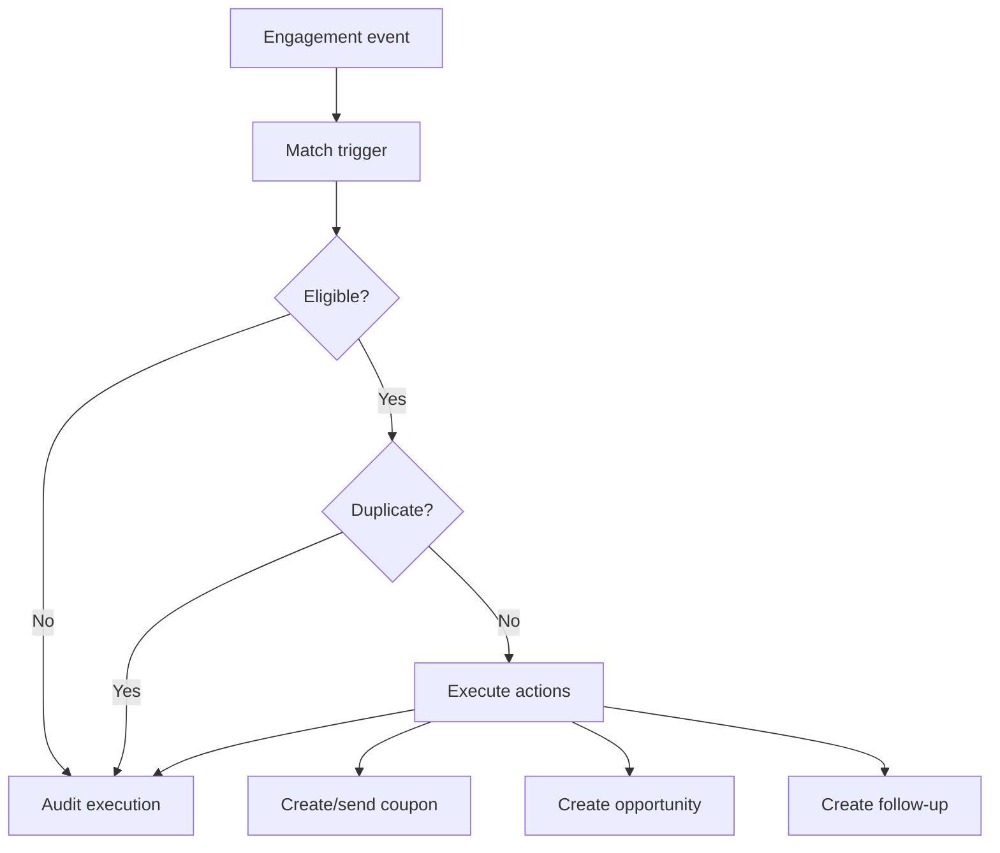

# Automation and coupon engine

Automation Engine reage a eventos recebidos de canais e executa acoes
controladas. IA nao e requisito do engine. IA futura pode enriquecer sugestoes,
classificacao ou respostas, mas o motor base deve funcionar por regras.

## Triggers

V1 deve suportar especialmente:

- `COMMENT_KEYWORD`
- `DIRECT_MESSAGE_KEYWORD`

Outros gatilhos candidatos:

- `FORM_SUBMITTED`
- `LINK_CLICKED`
- `QR_SCANNED`
- `COUPON_REQUESTED`
- futuro: `PROPOSAL_EXPIRING`
- futuro: `FOLLOWUP_OVERDUE`
- futuro: `BOOKING_CREATED`

## Actions

- `PUBLIC_REPLY`
- `PRIVATE_MESSAGE`
- `CREATE_COUPON`
- `SEND_COUPON`
- `CREATE_OPPORTUNITY`
- `ASSIGN_AGENT`
- `ADD_TAG`
- `CREATE_FOLLOWUP`

Cada acao precisa declarar se e idempotente, se exige conector, se exige RBAC e
se gera auditoria.

## Keyword viral automation

Caso: "Comente CANCUN e receba um cupom."

Configuracao:

- channel;
- campaign;
- publication;
- keyword;
- case sensitivity;
- public reply;
- private response;
- coupon;
- lead/opportunity creation;
- agent assignment;
- validity;
- cooldown;
- max executions.

## Deduplication

Mesmo usuario comentando varias vezes nao deve receber disparos identicos sem
respeitar cooldown e limites.

Chave de deduplicacao recomendada:

```text
agencyId
+ automationId
+ channel
+ externalUserId
+ normalizedKeyword
+ publicationId
```

Regras:

- normalizar keyword conforme configuracao de case sensitivity;
- registrar execucao antes de acao externa quando possivel;
- aplicar cooldown por usuario e automation;
- aplicar `maxExecutions` global;
- aplicar `maxExecutionsPerExternalUser` quando configurado;
- nunca criar multiplas oportunidades iguais para o mesmo usuario/campanha sem
  regra explicita.

## Automation flow



## Coupon

Coupon e dominio proprio, nao apenas texto em campanha.

Tipos:

- `FIXED_AMOUNT`
- `PERCENTAGE`
- `BENEFIT`

Campos conceituais:

- `code`
- `name`
- `type`
- `value`
- `benefitDescription`
- `startsAt`
- `expiresAt`
- `maxUses`
- `maxUsesPerCustomer`
- `campaignId` opcional
- `offerId` opcional
- `active`

## CouponGrant

CouponGrant representa emissao ou disponibilizacao de cupom para um customer ou
external user conhecido. Deve preservar:

- coupon;
- campaign;
- publication;
- automation;
- external user/customer;
- issuedAt;
- expiresAt efetivo;
- delivery channel;
- status.

## CouponRedemption

CouponRedemption representa uso do cupom em Proposal, Sale ou fluxo futuro.
Deve preservar:

- coupon;
- grant quando existir;
- customer;
- proposal/sale;
- amount/benefit aplicado;
- redeemedAt;
- reversedAt quando houver reversao futura.

## Metricas

Preparar:

- issued;
- used;
- conversion;
- revenue;
- margin.
