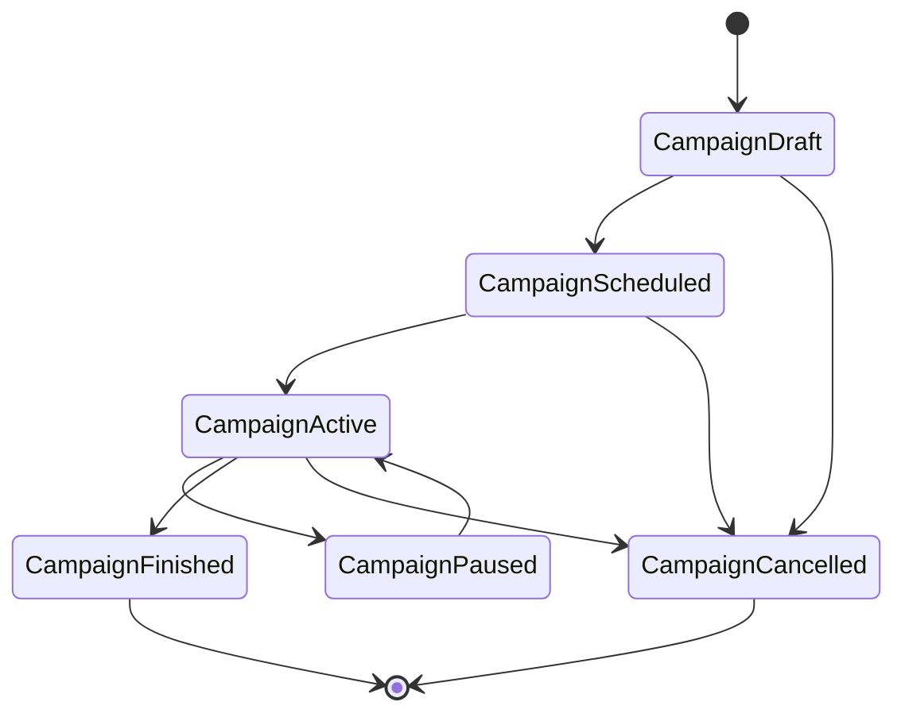
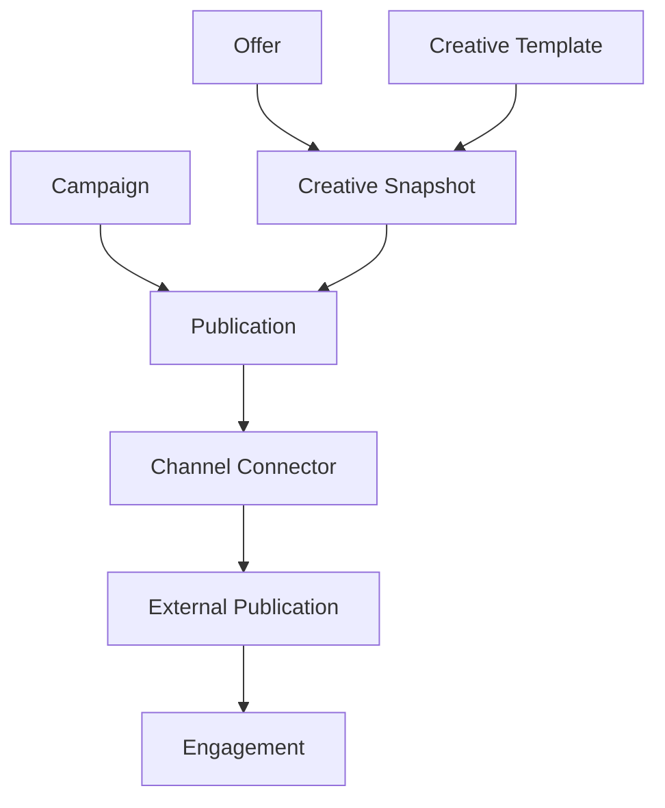

# Campaigns and publications

Campaign e a unidade de orquestracao. Publication e a unidade de entrega em um
canal. Offer nao possui boolean simples `published`.

## Campaign

Campos conceituais:

- `name`
- `description`
- `startsAt`
- `endsAt`
- `publicationStartsAt`
- `publicationEndsAt`
- `timezone`
- `status`

Status candidatos:

- `DRAFT`
- `SCHEDULED`
- `ACTIVE`
- `PAUSED`
- `FINISHED`
- `CANCELLED`

Uma Campaign pode conter:

- offers;
- publications;
- automations;
- coupons;
- channels.

Campanha pode ter periodo geral. Publicacoes podem ter agendamento individual.

## Publication

Publication relaciona:

- Campaign;
- Offer;
- CreativeTemplate;
- Channel;
- Creative snapshot/version;
- `publishedAt`;
- `scheduledAt`;
- `status`;
- `externalPublicationId`.

Status candidatos:

- `DRAFT`
- `SCHEDULED`
- `PUBLISHING`
- `PUBLISHED`
- `FAILED`
- `CANCELLED`
- `ARCHIVED`

## Snapshot historico

Publication deve preservar o conteudo efetivamente publicado. Se o preco da
Offer mudar depois, analytics e atendimento ainda precisam saber o que o
cliente viu no canal original.

Snapshot minimo:

- `offerId`;
- `campaignId`;
- `templateId`;
- `channel`;
- content JSON resolvido;
- assets resolvidos;
- preco e condicoes renderizados;
- texto/caption;
- data de geracao;
- data de publicacao.

## Campaign/Publication flow

## Approval opcional

Campanha ou automacao pode exigir aprovacao conforme configuracao da agencia.

Estados possiveis:

- `DRAFT`
- `PENDING_APPROVAL`
- `ACTIVE`
- `PAUSED`
- `FINISHED`

Approval nao deve ser obrigatorio para todas as agencias no V1. O mecanismo
deve ser configuravel e auditavel.
