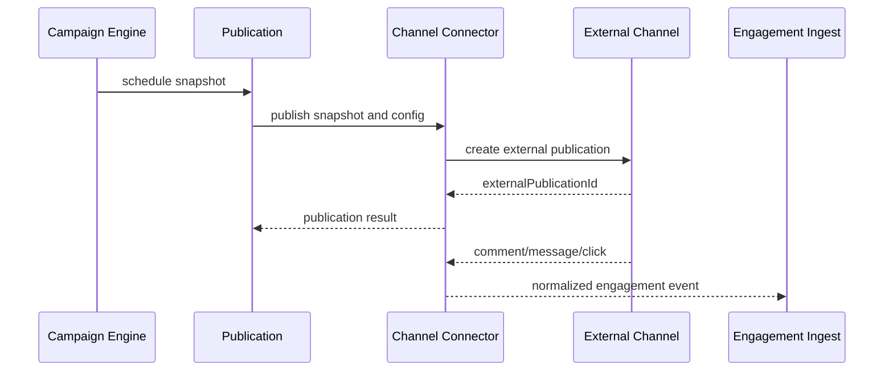

# Channel connector contract

Channel Connector e um adapter. Ele envia e recebe dados de canais, mas nao
possui logica comercial do Travel Platform.

## Canais futuros

- Instagram;
- Facebook;
- WhatsApp;
- Email;
- Website;
- Customer Portal;
- Google;
- Other.

## Capabilities

Cada conector declara capabilities:

- `canPublish`
- `canUpdatePublication`
- `canReceiveComments`
- `canReceiveMessages`
- `canReceiveLeads`
- `canTrackClicks`
- `canReceiveEngagement`

Capabilities devem ser consultadas antes de ativar campanha, publicacao ou
automacao que dependa delas.

## Interface conceitual

```typescript
interface ChannelConnector {
  channel: string;
  capabilities: ChannelCapabilities;
  publish(input: PublishInput): Promise<PublishResult>;
  updatePublication(input: UpdatePublicationInput): Promise<PublishResult>;
  receiveEngagement(event: ConnectorEvent): Promise<EngagementInput>;
  validateConfiguration(config: unknown): Promise<ConnectorValidationResult>;
}
```

Este contrato e ilustrativo. A implementacao futura deve adaptar nomes e tipos
ao padrao TypeScript do repositorio.

## Responsabilidades permitidas

- validar configuracao tecnica do canal;
- transformar payload externo em evento interno;
- publicar snapshot recebido do engine;
- retornar IDs externos;
- expor erro tecnico ou rate limit;
- informar metricas brutas disponiveis.

## Responsabilidades proibidas

- criar Proposal diretamente;
- criar Sale diretamente;
- decidir desconto/cupom fora do Coupon Engine;
- atribuir vendedor sem Automation/RBAC;
- gravar `agencyId` vindo do frontend como fonte de verdade;
- contornar entitlement;
- ignorar deduplicacao definida pelo Automation Engine.

## Publication adapter flow



## Sem APIs externas neste contrato

Este documento nao implementa Meta API, WhatsApp API, Google API, email provider
ou qualquer SDK externo. Ele define apenas o contrato esperado para adapters.
