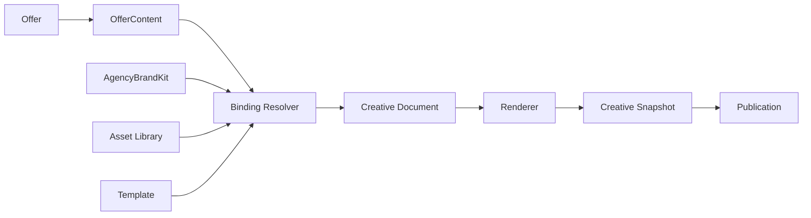

# Creative Studio contract

Creative Studio e um engine estruturado para produzir criativos reutilizaveis a
partir de templates, dados e assets. Ele nao e um Canva completo e nao deve
conhecer diretamente Pescador, Customer, Booking, TransportOperation, Supplier
ou Trip.

## Conceitos

| Conceito | Responsabilidade |
|----------|------------------|
| Template | Define formato, paginas, blocos, slots e regras de preenchimento |
| TemplatePage | Uma pagina/frame dentro de um template |
| Block | Unidade visual estruturada |
| Slot | Espaco preenchivel dentro de um bloco |
| Binding | Mapeamento de slot para campo estruturado |
| Asset | Midia reutilizavel |
| Renderer | Produz output para formato/canal |
| Document | Snapshot renderizavel ou renderizado |

## Blocos candidatos

- `IMAGE`
- `TEXT`
- `TITLE`
- `PRICE`
- `PAYMENT`
- `LIST`
- `TABLE`
- `GRID`
- `CTA`
- `LOGO`
- `DIVIDER`
- `BADGE`

## Formatos

- `SINGLE`
- `CAROUSEL`
- `GRID`
- `STORY`
- `FEED`
- `LANDING_BLOCK`
- `PDF_FUTURE`

## Data binding

Binding conecta slot de template a campo estruturado. Exemplos:

| Slot | Binding |
|------|---------|
| `heroImage` | `offer.images[0]` |
| `title` | `offer.title` |
| `price` | `offer.price` |
| `payment` | `offer.payment` |
| `agencyLogo` | `agency.brand.logo` |
| `primaryColor` | `agency.brand.colors.primary` |

Template nao conhece Pescador. Capturas aprovadas viram Offer/OfferContent
antes de qualquer renderizacao.

## Creative pipeline

## AgencyBrandKit

AgencyBrandKit e o contrato para identidade da agencia:

- logo;
- colors;
- typography;
- phone;
- WhatsApp;
- website;
- social handles.

Templates podem consumir `agency.brand.*`, mas nao podem alterar o Brand Kit.

## Snapshots

Todo criativo publicado deve gerar snapshot/version. O snapshot preserva:

- template usado;
- bindings resolvidos;
- assets e variantes;
- texto final;
- preco e condicoes no momento da publicacao;
- renderer e formato;
- timestamp de geracao.

Snapshots sao necessarios para auditoria, atribuicao e reproducao historica.

## Reutilizacao fora do Travel Platform

Para viabilizar extracao futura, Creative Studio deve depender apenas de:

- schema de template;
- schema de dados estruturados;
- Asset abstraction;
- Renderer contract;
- BrandKit contract.

Dependencias de turismo ficam nos adaptadores que produzem OfferContent, nao no
engine criativo.
