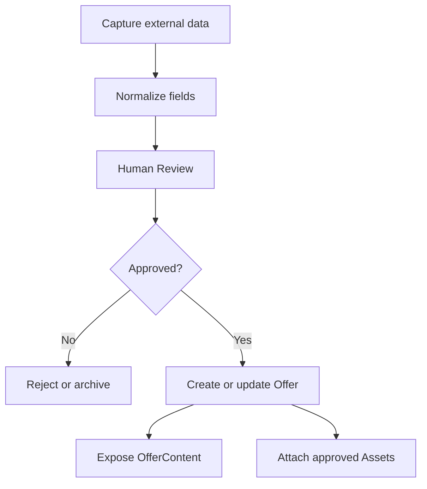

# Offer & Growth Engine domain model

Este documento define o modelo conceitual. Ele nao cria tabelas nem altera
`schema.prisma`.

## Acquisition

### ExternalOfferCapture

Representa dados externos brutos adquiridos pelo Pescador ou por outro
conector. Pode conter titulo externo, preco bruto, descricao bruta, URL de
origem, fornecedor externo, imagens brutas e metadados de origem.

Regras:

- pertence a uma agencia;
- nao e uma Offer;
- nao pode ser publicado diretamente;
- deve passar por normalizacao e revisao humana;
- pode ser aprovado, rejeitado ou transformado em Offer por acao explicita.

### Offer

Representa a oferta comercial oficial da agencia. Continua sendo o objeto
comercial reutilizavel que pode originar proposta, campanha e venda.

Regras:

- pertence a uma agencia;
- nao deve guardar proveniencia externa bruta como fonte de verdade;
- pode receber dados normalizados vindos de uma captura aprovada;
- pode ser usado em multiplas campanhas e publicacoes.

### OfferContent

Representa dados estruturados para consumo por templates e renderers.

Campos conceituais:

- `title`
- `subtitle`
- `description`
- `destination`
- `price`
- `payment`
- `validity`
- `includedItems`
- `excludedItems`
- `terms`
- `images`
- `badges`
- `cta`

OfferContent pode ser derivado de Offer, mas existe como contrato de leitura
para Creative Studio. Template nao consulta Pescador nem captura externa.

### Asset

Representa imagem, video, logo, icone ou documento reutilizavel.

Tipos:

- `IMAGE`
- `VIDEO`
- `LOGO`
- `ICON`
- `DOCUMENT`

Origens:

- `PESCADOR`
- `UPLOAD`
- `AGENCY_LIBRARY`
- `SUPPLIER`
- `GENERATED`
- `EXTERNAL_CONNECTOR`

### AssetSource e AssetMetadata

AssetSource descreve origem, conector, fornecedor, URL original, licenca,
autor, hash de deduplicacao e restricoes de uso. AssetMetadata descreve largura,
altura, duracao, mime type, tamanho, idioma, tags, safe-area e variantes.

## Growth entities

### Campaign

Entidade propria que agrupa objetivos comerciais, ofertas, publicacoes,
automacoes, cupons e canais.

Campos conceituais:

- `name`
- `description`
- `startsAt`
- `endsAt`
- `publicationStartsAt`
- `publicationEndsAt`
- `timezone`
- `status`

Status candidatos:

- `DRAFT`
- `SCHEDULED`
- `ACTIVE`
- `PAUSED`
- `FINISHED`
- `CANCELLED`

### Publication

Representa a tentativa planejada, agendada ou efetivada de publicar um snapshot
criativo em um canal.

Relacionamentos conceituais:

- Campaign;
- Offer;
- CreativeTemplate;
- Channel;
- creative snapshot/version;
- `scheduledAt`;
- `publishedAt`;
- `status`;
- `externalPublicationId`.

Publication preserva historico. Alterar preco da Offer depois da publicacao nao
apaga o conteudo que o cliente viu.

### Engagement

Representa interacao recebida de canal.

Tipos candidatos:

- `COMMENT`
- `MESSAGE`
- `CLICK`
- `FORM`
- `QR`
- `COUPON_REQUEST`

Relacionamentos quando conhecidos:

- agency;
- campaign;
- publication;
- offer;
- channel;
- external user;
- customer;
- opportunity.

### Automation

Define regras acionadas por eventos. Nao exige IA.

Gatilhos candidatos:

- `COMMENT_KEYWORD`
- `DIRECT_MESSAGE_KEYWORD`
- `FORM_SUBMITTED`
- `LINK_CLICKED`
- `QR_SCANNED`
- `COUPON_REQUESTED`
- futuro: `PROPOSAL_EXPIRING`, `FOLLOWUP_OVERDUE`, `BOOKING_CREATED`.

Acoes candidatas:

- `PUBLIC_REPLY`
- `PRIVATE_MESSAGE`
- `CREATE_COUPON`
- `SEND_COUPON`
- `CREATE_OPPORTUNITY`
- `ASSIGN_AGENT`
- `ADD_TAG`
- `CREATE_FOLLOWUP`

### Coupon

Dominio proprio de beneficio/desconto, detalhado em `automation-engine.md`.

Tipos:

- `FIXED_AMOUNT`
- `PERCENTAGE`
- `BENEFIT`

## Comercial existente

Engagement pode criar CustomerInteraction e CommercialOpportunity quando houver
intencao comercial suficiente. O engine nao duplica CRM. Ele preserva origem:

- `sourceChannel`
- `campaignId`
- `publicationId`
- `offerId`
- `automationId`

CommercialOpportunity continua sendo a entrada de trabalho comercial que pode
evoluir para Proposal e Sale.

## Fluxo de aquisicao

## Dependencias proibidas no Creative Studio

Creative Studio nao deve depender diretamente de:

- Customer;
- Booking;
- TransportOperation;
- Supplier;
- Trip.

Ele consome abstracoes: Template, TemplatePage, Block, Slot, Binding, Asset,
Renderer e Document.
