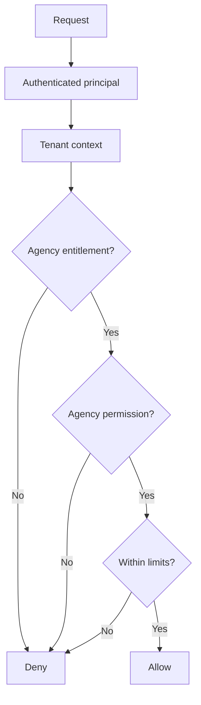

# Entitlements and agency RBAC

Entitlements sao plataforma. RBAC e agencia. As duas camadas nao devem ser
misturadas.

## Camada de plataforma

Super Admin controla quais features estao disponiveis para cada agencia.

Conceitos:

- PlatformFeature;
- AgencyEntitlement.

Features candidatas:

- `PESCADOR`
- `CREATIVE_STUDIO`
- `CAMPAIGNS`
- `SOCIAL_PUBLISHING`
- `SOCIAL_AUTOMATION`
- `WHATSAPP`
- `AI_ASSISTANT`
- `ADVANCED_ANALYTICS`
- `GDS`

AgencyEntitlement pode incluir limits:

- executions per month;
- automations;
- publications;
- storage;
- connected channels;
- active campaigns;
- generated assets.

Nao espalhar `if plan === X` pelo sistema. Planos futuros devem atribuir
entitlements.

## Camada de agencia

Depois de existir entitlement, RBAC da agencia decide quem pode executar a
acao.

Permissoes conceituais:

- `campaign.read`
- `campaign.write`
- `campaign.publish`
- `creative.read`
- `creative.write`
- `automation.read`
- `automation.write`
- `automation.activate`
- `coupon.manage`
- `connector.configure`
- `analytics.read`

Nao alterar a hierarquia atual ainda. Este documento define policy mapping
recomendado.

## Ordem de autorizacao

## Mapping recomendado

| Capability | Entitlement | RBAC |
|------------|-------------|------|
| Listar campanhas | `CAMPAIGNS` | `campaign.read` |
| Criar/editar campanha | `CAMPAIGNS` | `campaign.write` |
| Publicar campanha | `SOCIAL_PUBLISHING` | `campaign.publish` |
| Usar Creative Studio | `CREATIVE_STUDIO` | `creative.write` |
| Ativar automacao | `SOCIAL_AUTOMATION` | `automation.activate` |
| Gerenciar cupons | `CAMPAIGNS` | `coupon.manage` |
| Configurar conector | feature do canal | `connector.configure` |
| Ler analytics avancado | `ADVANCED_ANALYTICS` | `analytics.read` |

## Super Admin

Agency users nao podem habilitar entitlement por API propria. Qualquer mudanca
de entitlement deve ser executada por contexto de plataforma e auditada fora do
RBAC comum da agencia.
